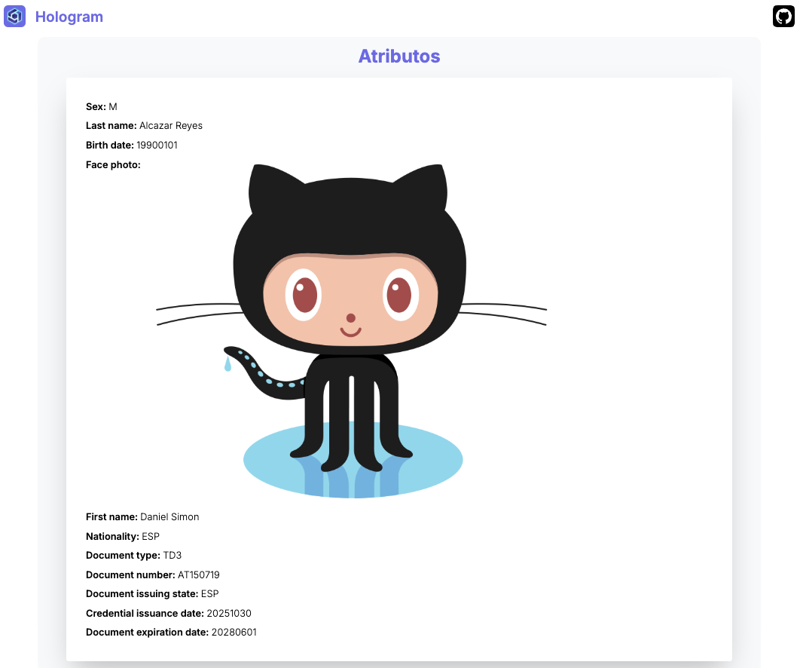

This is a [Hologram](https://hologram.zone/) web app where you can make a presentation request credential demo using Hologram Mobile App

## Getting Started

## First of all

Install dependencies

```bash
yarn install
```

## Run in developer mode

```bash
yarn dev
```

## Run in production mode

```bash
yarn build && yarn start
```

## Configuration

At the moment, all configuration is done by environment variables. All of them are optional for development
but likely needed for production and test deployments.

| Variable                     | Description                                   | Default value                                                                                                        |
| ---------------------------- | --------------------------------------------- | -------------------------------------------------------------------------------------------------------------------- |
| NEXT_PUBLIC_BASE_URL         | Public URL without port where app is deployed | http://localhost:${NEXT_PUBLIC_PORT}                                                                                 |
| NEXT_PUBLIC_PORT             | Port where app is listening                   | 3000                                                                                                                 |
| CREDENTIAL_DEFINITION_ID     | Unique identifier or Credential types         | did:web:chatbot-demo.dev.2060.io?service=anoncreds&relativeRef=/credDef/HngJhYMeTLTZNa5nJxDybmXDsV8J7G1fz2JFSs3jcouT |
| SERVICE_AGENT_ADMIN_BASE_URL | Service agent base URL                        | https://a.chatbot-demo.dev.2060.io                                                                                   |

## About this web app

This app was built using [Next.js framework](https://nextjs.org) and [Socket.IO](https://socket.io) for its web socket server.

## How to use this web app

1. First of all you need to have Hologram mobile app installed in your device.

2. Make sure you have a credential emitted by ChatBot Service. Otherwise, you wont be able to present any credential. If you do not have it, request it to chat bot service and accept it

3. Scan QR code of this web app in your Hologram app and present the credential that mobile app ask you. After present it you should see page screen as the next image


